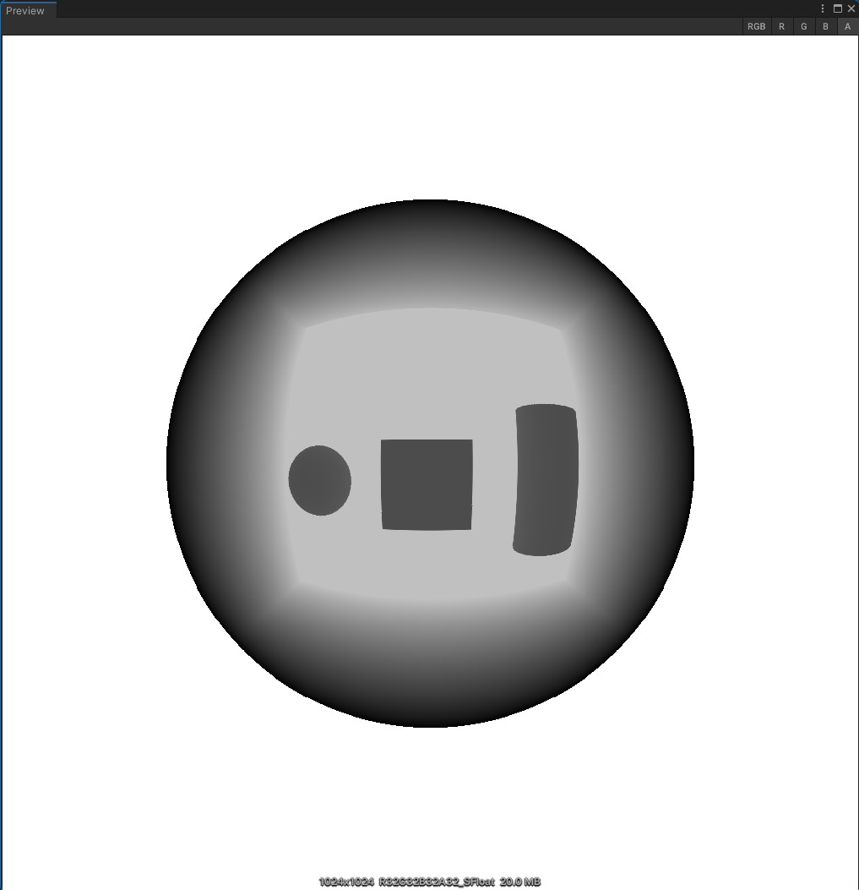

# Unity Double Sphere RGBD

This is the unity simulation repo for Double Sphere Based Fisheye Camera.

This Double Sphere model can work well and generate not only RGB image, but the **depth** can be captured as well.

Based on Paper [The Double Sphere Camera Model](https://vision.in.tum.de/research/vslam/double-sphere)

Double Sphere Shader is heavily borrowed from https://github.com/psiorx/Unity-Fisheye, but this whole project can not work fine when I'm actually using.

# Usage

## Generate Prefab
Add the scripts and shaders in your own unity project.

Right click for Double Sphere Camera Prefab Generation.

The double sphere camera model contains params: `fx, fy, resolution, alpha` and `chi`. `fx` and `fy` are the camera intrinsic, resolution is the capture resolution, and half of this is the `cx` and `cy`. `alpha` and `chi` are the double sphere model params, you can know further details in the paper.

By clicking `Generate`, you can find the double sphere camera prefab in current dictionary.

## Data format

The repo first uses a project pass to fetch the depth cubemap, and use a standard shader for getting RGB cubemap.

In double sphere distortion, I make the depth information stored in the alpha channel. So you can fetch depth picture by alpha channel.

Render result stored in `TargetTexture` in the root GameObject.

The simple result of RGB image is shown blow.

The simple result of depth image is shown blow.

# License

MIT License